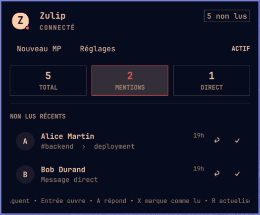

# Zulip Hub pour Omarchy

Zulip Hub intègre à la barre Omarchy les compteurs non lus, les conversations
récentes, les notifications natives, l’envoi de messages directs et un
workspace Zulip facultatif. L’interface suit le thème Omarchy et s’utilise
entièrement au clavier.



## Prérequis

- Omarchy avec le système de plugins Quattro
- Python 3.11 ou plus récent
- `secret-tool` fourni par libsecret
- une clé API personnelle Zulip

## Installation

```sh
omarchy plugin add https://github.com/valentin-briez-banuls/omarchy-zulip-hub.git --enable
```

Ouvrez ensuite le widget et renseignez l’URL HTTPS du serveur, l’adresse du
compte et la clé API. Aucun terminal n’est nécessaire après l’ajout du plugin.

Dans **Réglages → Intégration Omarchy**, l’utilisateur peut autoriser
explicitement `Super+Z` pour le panneau et `Super+Maj+Z` pour le workspace.

## Utilisation au clavier

- `Tab`, flèches ou `j` / `k` : naviguer ;
- `Entrée` : activer ou ouvrir ;
- `Ctrl+Entrée` : envoyer un message direct ;
- `X` : marquer comme lu ; `R` : actualiser ; `Échap` : revenir.

## Données et sécurité

Le plugin crée uniquement des données appartenant à l’utilisateur sous
`~/.config/zulip-hub`, `~/.local/state/zulip-hub`, Secret Service et,
facultativement, `~/.config/hypr/`. La clé API ne figure jamais dans les
arguments d’un processus, les fichiers ou les journaux.

## Désinstallation

Retirez d’abord les raccourcis dans **Réglages → Intégration Omarchy**, puis :

```sh
omarchy plugin remove io.github.valentin-briez-banuls.zulip-hub
```

La configuration et le secret sont conservés. Pour supprimer la clé, utilisez
**Modifier le compte Zulip → Déconnecter** avant le retrait.

## Licence

MIT © 2026 Valentin Briez-Banuls
